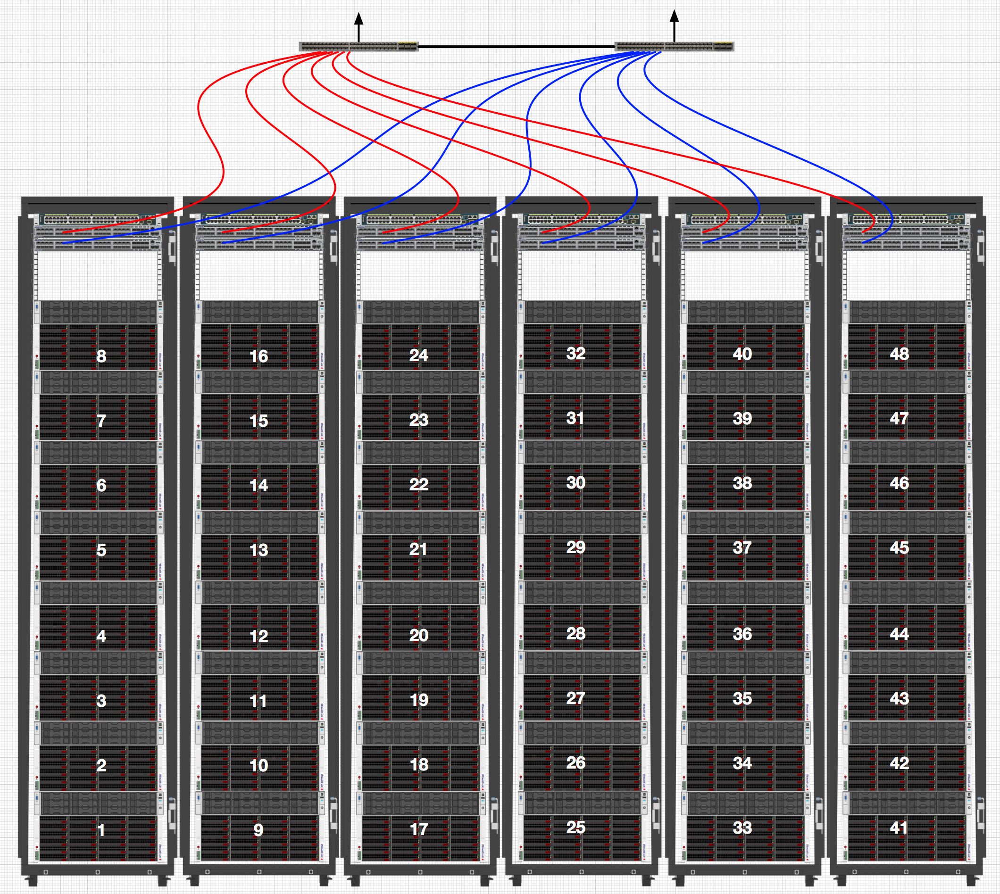

:deconsttitle: Hummingbird Architecture

========================
Hummingbird Architecture
========================

Overall, the Hummingbird architecture is much like the `OpenStack Swift architecture`_. Below are the main differences from what you may be used to with OpenStack Swift:

.. _`OpenStack Swift architecture`: https://docs.openstack.org/swift/latest/overview_architecture.html

All executables are folded into a single hummingbird executable with subcommands, including smaller tools like nodes, oinfo, etc. Packaging and deployment scripts may create multiple scripts or service files, but these simply wrap calls to the single hummingbird executable.

Auditors and Updaters are folded into the Replicators.

Dispersion Report and Drive Audit features are implemented within Andrewd.

Expiring objects are supported, but not actively deleted after expiration. Active clean up may be implemented in the future.

No Account Reaper, which removes the contents of deleted accounts in the background. This should be implemented in the future.

No Container Reconciler, which resolves issues with conflicting policies within a single container. A tool for this may be implemented in the future.

No support for Swift's Container Sync feature.

No support for Swift's EC feature. Hummingbird will support erasure coding, but the implementation will be quite different with no plans to support Swift's implementation.

No support for Swift's Modifying Ring Partition Power feature, therefore no equivalent of the swift-object-relinker.

No support for Swift's Symbolic Linking feature at this time.

.. image:: hummingbird_architecture.png

========================
Supported Hardware
========================

Rackspace Data Center
------------------------

**HPE 4510-G10 (Currently Considered a One-Off)**

- **Capacity:** 454TB RAW per Node
- **Model:** HP DL380 Gen9 LFF - 3.5" Chassis
- **Processor:** Dual Socket Intel Xeon Processor 6142 (16 Core 2.6GHz)
- **Memory:** 192 GB
- **Onboard NIC:** HPE Eth 10/25Gb 2P 640FLR-SFP28 NIC (MLNX-CX4)
- **Additional NIC:** HPE Eth 10/25Gb 2P 640-SFP28 NIC (MLNX-CX4)
- **RAID Controllers:** 1x HPE Smart Array E208i-a SR, 2x HPE Smart Array P408i-p SR
- **Drives:** 2x 960 GB SSD(OS), 10x 1.92TB SSD (MU), 50x 10TB NL-SAS/SATA

**HPE DL380-G9**

- **Capacity:** 37TB RAW per Node
- **Model:** HP DL380 Gen9 LFF - 3.5" Chassis
- **Processor:** Dual Socket Octo Core Intel Xeon E5-2630 2.40 Ghz
- **Memory:** 128 GB
- **Onboard NIC:** HP 561-T Dual Port 10GbE Base-T PCIe NIC (RJ-45)
- **Additional NIC:** HP 561-T Dual Port 10GbE Base-T PCIe NIC (RJ-45)
- **Drives:** 2x 600 GB SAS(OS), 2x 960GB SSD (MU), 8x 6TB NL-SAS/SATA

**Supermicro JBOD**

- **Model:** E16 or E26
- **Drives:** 45x SATA Drives

**Dell R740XL-XL**

- **Capacity:** 72TB RAW per Node
- **Model:** Dell R740XD-XL - 3.5" Chassis
- **Processor:** Dual Socket Intel Xeon Processor 4110 (8 Core 2.1 GHz)
- **Memory:** 192 GB
- **Onboard NIC:** Intel X550 4-port 10GbE Base-T (RJ-45)
- **Additional NIC:** Intel X550 2-port 10GbE Base-T (RJ-45)
- **Drives:** 2x 480 GB SSD(OS), 2x 960GB SSD (MU), 10x 8TB NL-SAS/SATA

**Networking**

- F5 Loadbalancer
- HAProxy
- 10GbE Networking

Customer Data Center
------------------------

- HPE 4510-G10
- HPE DL380-G9
- Supermicro E16/E26 JBOD
- Dell R740XL-XL 
- Others on request
- F5 Loadbalancer
- HAProxy 
- 10/25/40/50/100GbE Networking

**A customer must adhere to certain guidelines when procuring or re-purposing existing hardware.  A Hummingbird cluster made from non-ideal, or inconsistent hardware will lead to a poor user experience.**

*Generally the following recommendations should be followed when not using the node configurations detailed above.*

- **CPUs** - 1 CPU Core to 2 Object Disks, CPUs should be no older than Haswell
- **RAM per Object Storage Disk** - A minimum allocation of 2GB RAM
- **SSD to Object Storage Ratio** - Recommend that SSD capacity is approximately 4% of total Object storage
- **SSD Endurance** - SSDs are required to be NVMe/SSD with a duty cycle of a minimum of 5TBWPD.
- **Object Storage Drives** - NVMe, SSD, SAS, NL-SAS or SATA supported
- **Operating System Drives** - Must be a RAID1 pair of minimum SAS drives
- **Networking** - No less than 2x 10GbE or 2x 25GbE or 2x 40GbE Ports per node.  Jumbo frames highly recommended. Care must be taken to size TOR uplinks to aggregation switches to avoid creating a bottleneck.

Supported Deployments
------------------------

- A minimal number of nodes equal to the number of replicas or number of EC shards is required, growth increments are then in increments of that same number.
- All storage nodes **must** have HA networking
- All cabinets **must** provide HA networking

For example, a 3-Replica cluster could start with nodes 1,9,17 below, scaling up to 24 nodes, before scaling out to another 3 cabinets for nodes 25 through 48.

